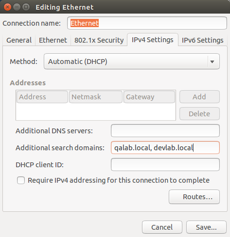

# Getting Linux to work at VHT

## Nameservice Switching

In order to resolve domains that end in .local, change the following line in /etc/nsswitch.conf

```
hosts: files mdns4_minimal [NOTFOUND=return] dns
```

to read

```
hosts: files mdns4_minimal dns
```

## Additional Search Domains

You need to add `qalab.local, devlab.local` to the Additional Search Domains entry in the IPv4 Settings for your network connection.



## FreeTDS ODBC Driver

FreeTDS is an open source driver to connect to SQL Server (and, by extension, Sybase) databases. The ODBC driver for it allows the unixodbc system to connect to SQL Server. This, in turn, enables Erlang's odbc module to connect to our SQL Server databases. Install the TDS ODBC driver by typing

```
sudo apt-get install tdsodbc
```

Then identify the actual driver to use. Also, provide a better default protocol version (that actually works with SQL Server). Update your /etc/odbcinst.ini file with the new driver, as

```
[FreeTDS]
Driver = /usr/lib/x86_64-linux-gnu/odbc/libtdsodbc.so
TDS Version = 7.2
```

## General Compilation

`sudo apt-get install build-essential`

## Build Erlang

Acquire the `make-erlang-alternative` script.
Download **OTP 17.3** (src and doc_man) from [the Erlang web site](http://erlang.org), as build with the following recipe

### Install Pre-Requisites (Debian/Ubuntu)
```sh
sudo apt-get install build-essential libncurses5-dev unixodbc-dev libssl-dev openjdk-7-jdk libwxgtk2.8-dev libglu1-mesa-dev # installs the build dependencies
```

### Install Pre-Requisites (Fedora/RedHat)
```sh
sudo yum groupinstall "Development Tools" "Development Libraries"
sudo yum install ncurses-devel unixODBC-devel openssl-devel java-1.8.0-openjdk-devel wxGTK-devel 
```

### Download the tarball, configure, make and install
```sh
mkdir ~/src
cd ~/src
curl http://www.erlang.org/download/otp_src_17.3.tar.gz | tar -xz -f -
cd otp_src_17.3
./configure --prefix=/opt/erlang/17.3
make
sudo make install
curl http://www.erlang.org/download/otp_doc_man_17.3.tar.gz | sudo tar -xz --strip-components=1 -C /opt/erlang/17.3/lib/erlang/erts-6.2/man -f -
curl -sSL https://raw.githubusercontent.com/glyphrider/linux_at_vht/master/make-erlang-alternative | bash -s /opt/erlang/17.3 1703 | bash -s # 1703 is the priority
```

You can, later, install other versions of erlang and use the alternative scripts to quickly switch betweeen them.

## Build NodeJS

Download NodeJS from [the NodeJS web site](http://nodejs.org) and build into `/usr/local`

```
cd ~/src
tar xzf ~/Downloads/nodejs-*.tar.gz
./configure
make
sudo make install
```

Get the needed global packages installed

```
sudo npm install -g grunt-cli
sudo npm install -g bower
```

You should see executables in `/usr/local/bin` for `node`, `npm`, `grunt`, and `bower`.

## RVM and Ruby

Install [RVM](http://rvm.io) from the web.

```
sudo apt-get install curl git-core gpg
gpg --keyserver hkp://keys.gnupg.net --recv-keys 409B6B1796C275462A1703113804BB82D39DC0E3
\curl -sSL https://get.rvm.io | bash -s stable
```

Update your gnome-terminal settings to `run command as a login shell`. Restart the terminal. RVM should now work, so you can install ruby.

The **tk** extensions will require `sudo apt-get install tk-dev tcl-dev`.

```
rvm install 1.9 --with-tclConfig-file=/usr/lib/x86_64-linux-gnu/tclConfig.sh --with-tkConfig-file=/usr/lib/x86_64-linux-gnu/tkConfig.sh
```

## HipChat

The instructions for installing hipchat, from their [web site](http://hipchat.com) involve `sudo su`, so I don't like them. Here's how to accomplish the same thing with appropriate sudos. It also shows off a cute trick involving `tee`.

```
echo "deb http://downloads.hipchat.com/linux/apt stable main" | sudo tee /etc/apt/sources.list.d/atlassian-hipchat.list
wget -O - https://www.hipchat.com/keys/hipchat-linux.key | sudo apt-key add -
sudo apt-get update
sudo apt-get install hipchat
```

Yes, I know... You now have to sudo each command. But, to me, this seems more correct. You are using sudo to elevate permissions only when you need to do so, and only for exactly what you need to accomplish. Sites that might restrict you sudo access to avoid `sudo -s` and `sudo su` would be appeased by the alternate approach.
